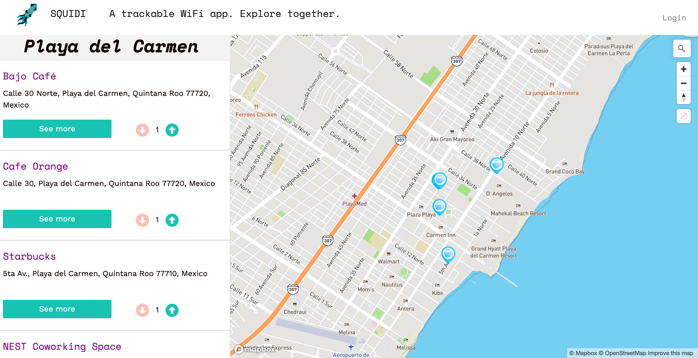

Rails app generated with [lewagon/rails-templates](https://github.com/lewagon/rails-templates), created by the [Le Wagon coding bootcamp](https://www.lewagon.com) team.

# [Squidy Tracking App](http://www.squidyapp.xyz/)

Source code for this Mapbox API tracking app ✨

Check the live version [here](http://www.squidyapp.xyz/) ⚡️



## 📦 Made with

- PostgreSQL DB
- Bootstrap Styles
- Mapbox API
- Acts as Votable gem
- Geocoder
- Devise 
- Cloudinary

## 💻 Getting Started

Make sure you have the latest `rails` installed, on a Ruby 2.4+ environment:

  rbenv versions # Do you have 2.4+?
  gem install rails
  rails -v # Do you have 5.1+?

Install dependencies:

```bash
npm install
# or
yarn
```

Then, run the development server:

```bash
npm run dev
# or
yarn dev
```

Then run it:

  rails db:create
  rails db:migrate

Open [http://localhost:3000](http://localhost:3000) with your browser to see the result.